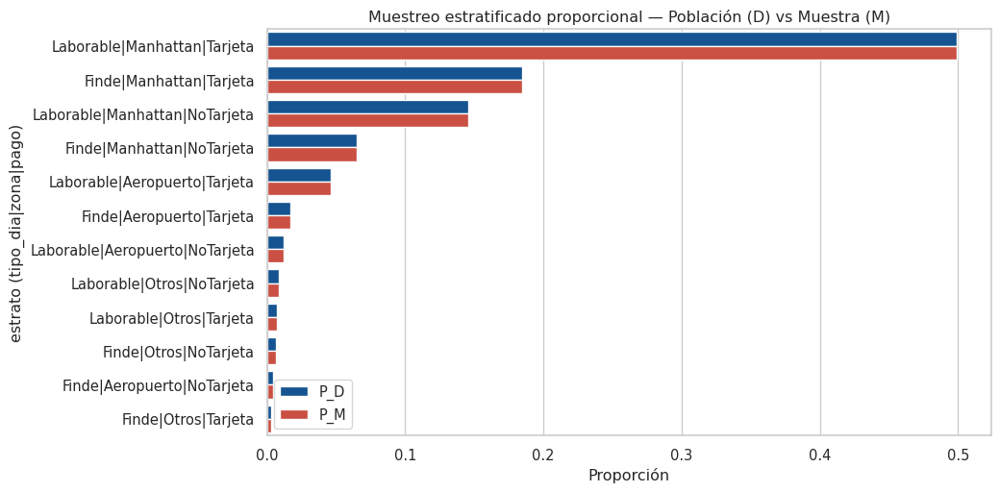
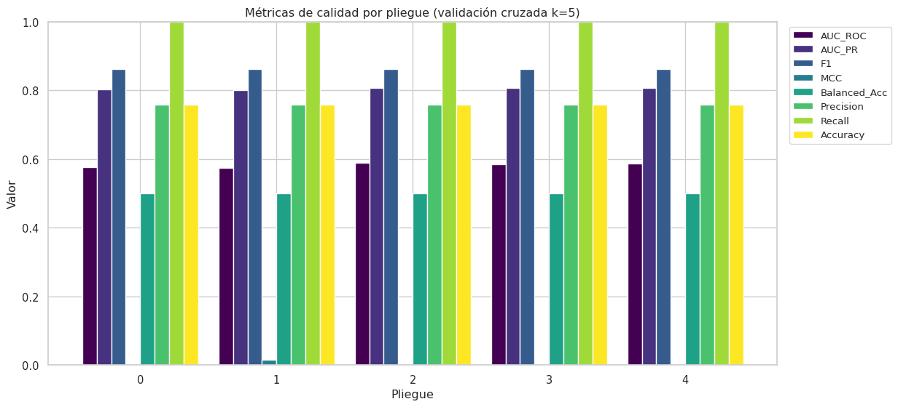
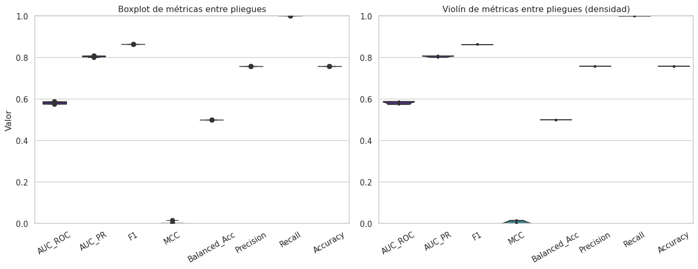
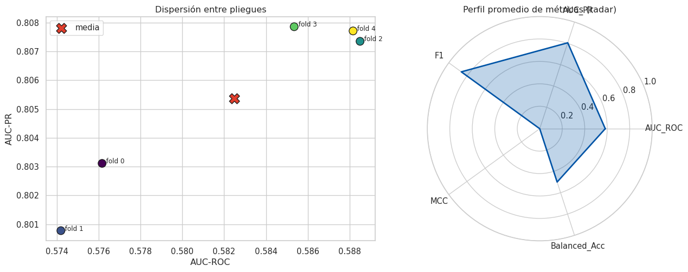
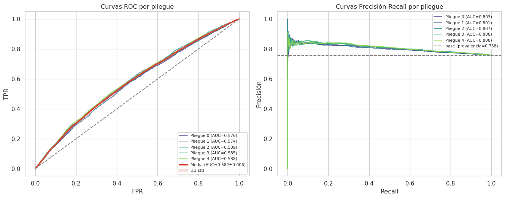
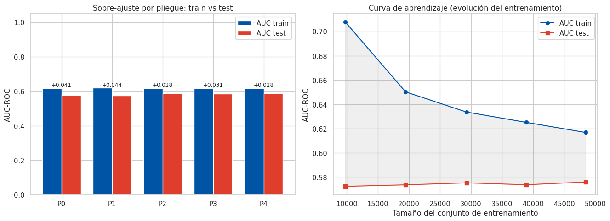
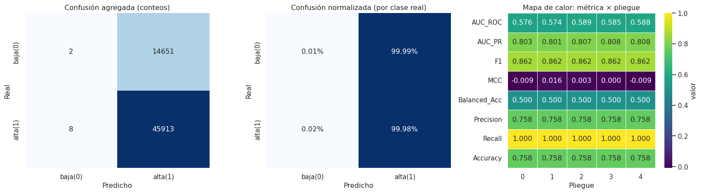
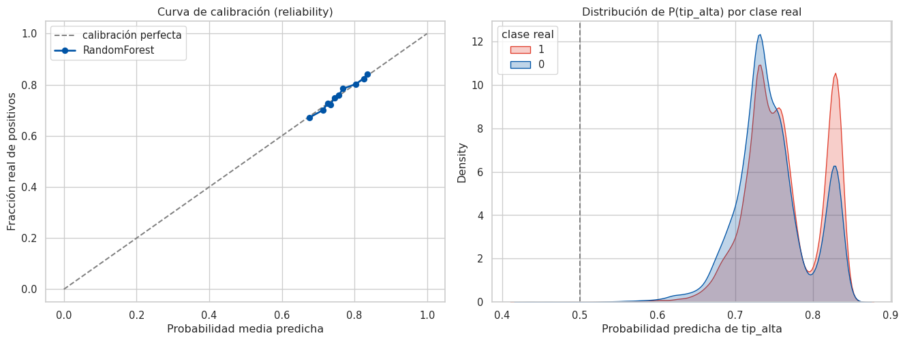
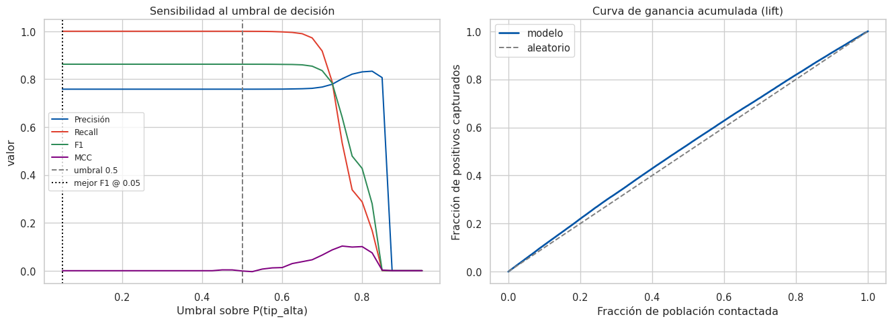
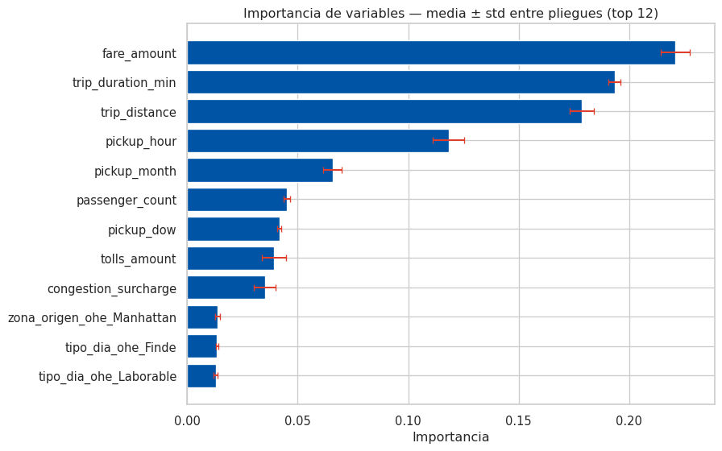

<h1 align="center">Actividad 5 | Visualización de Resultados</h1>

<p align="center"><b>Validación cruzada <i>k</i>-fold y visualización del mejor modelo sobre Big Data (PySpark)</b></p>

<p align="center">
Tecnológico de Monterrey · Maestría en Inteligencia Artificial Aplicada<br>
TC4034 — Análisis de Grandes Volúmenes de Datos · Módulo 6 (Semanas 9 y 10)<br>
Caso de estudio: NYC TLC <i>Yellow Taxi Trip Records</i> 2024
</p>

---

## Datos del entregable

| | |
|---|---|
| **Materia** | TC4034 — Análisis de Grandes Volúmenes de Datos |
| **Módulo** | 6 (Semanas 9 y 10) |
| **Profesor** | Dr. Iván Olmos Pineda |
| **Modalidad** | En equipo |
| **Entregable** | Visualización_Equipo61 |
| **Fecha de entrega** | 21 de junio de 2026 |

## Integrantes — Equipo 61

| Integrante | Matrícula |
|---|---|
| Eduardo Ramos Hernández | A01797393 |
| Diana Gabriela Ramírez Moreno | A01630769 |
| Oscar Ramírez Anaya | A01795438 |
| Emmanuel Francisco Ramírez Hernández | A01796289 |

---

## Descripción

Este repositorio mide la **variabilidad** y la **calidad de generalización** del mejor modelo de la
Actividad 4 —un `RandomForestClassifier` que predice si un viaje de taxi deja **propina alta**
(`tip_alta`)— mediante un proceso de **validación cruzada *k*-fold estratificada** sobre una muestra
representativa **M**, y **comunica los resultados con herramientas de visualización**. Se trabaja sobre la
base global **NYC TLC Yellow Taxi 2024** con **PySpark (MLlib)** y un muestreo estratificado proporcional
reutilizado del Módulo 3.

La pregunta que motiva la actividad es metodológica: una sola partición *train/test* entrega una cifra
**puntual** que puede ser optimista o pesimista por azar. La validación cruzada entrena y evalúa el modelo
*k* veces sobre particiones disjuntas, produciendo una **distribución** de cada métrica (media ±
desviación) y permitiendo **detectar sobre-ajuste**. El entregable comunica no solo el valor medio sino su
**incertidumbre**.

## Los datos

| | |
|---|---|
| **Fuente** | NYC Taxi & Limousine Commission (TLC), *Trip Record Data* (dominio público) |
| **Formato** | Parquet mensual oficial, 2024 |
| **Volumen** | **D = 41,169,720** registros crudos (12 meses) → **Silver 39,263,800** (−4.63 %) |
| **Muestra** | **M = 80,006** (Cochran + FPC, asignación proporcional, muestreo sistemático) |
| **Tarea** | Clasificación binaria: `tip_alta = 1` si `tip_amount / fare_amount > 0.20` (solo viajes con tarjeta) |
| **Estratos** | 12, definidos por `tipo_dia × zona_origen × tipo_pago` |

Cada registro es **un viaje**. El conjunto es un caso paradigmático de *Big Data* por sus **V** (Volumen,
Variedad, Veracidad, Valor). Los Parquet de 2024 presentan **heterogeneidad de tipos** entre meses, por lo
que se normalizan a un **esquema canónico** antes de unirlos. Para evitar **fuga de datos** se excluyen de
las características `payment_type`, `tip_amount` y `total_amount`. Los datos **no se versionan**; se
descargan con `start_jupyter.sh`.

## El notebook — descargar o visualizar

El entregable es un único notebook **ejecutado, con outputs y gráficos** (60 celdas):

- **Visor enriquecido (nbviewer, recomendado para tablas y Plotly):** https://nbviewer.org/github/oscar-ramirez-anaya/vis_resutlts/blob/main/Visualizacion_Equipo61.ipynb
- **Visualizar en GitHub:** [`Visualizacion_Equipo61.ipynb`](./Visualizacion_Equipo61.ipynb)
- **Descargar (raw):** https://raw.githubusercontent.com/oscar-ramirez-anaya/vis_resutlts/main/Visualizacion_Equipo61.ipynb

> El cómputo es **PySpark local** (`local[*]`). El mismo pipeline escala sin cambios a **GCP Dataproc**
> leyendo desde Cloud Storage. El parámetro `MESES` permite una corrida local más ligera (3 meses) sin
> cambiar la metodología.

## Metodología — las cinco secciones del notebook

1. **Definición del proceso de validación cruzada** — argumentación multidimensional del valor **k = 5**
   (sesgo–varianza de Kohavi, representatividad por estrato verificada y costo en *Big Data*), con tabla
   comparativa k = 3/5/10.
2. **Construcción de los *k*-folds** — reparto **estratificado y determinista** (`xxhash64`, reproducible,
   sin `rand()`) por `particion_id × tip_alta`, con verificación de disjunción/exhaustividad, balance de
   clase y composición por estrato.
3. **Experimentacion** — entrenamiento del mejor modelo por pliegue con métricas **distribuidas** (AUC-ROC,
   AUC-PR) y **binarias por clase** (F1, MCC, Balanced Accuracy), brecha de sobre-ajuste, tiempos y baseline.
4. **Resultados** — visualización (ver abajo) con tablas e interpretación a nivel posgrado tras cada gráfica.
5. **Discusión y conclusiones** — significancia frente al baseline, variabilidad (CV %, IC 95 %),
   generalización, limitaciones y trabajo futuro.

## Proceso realizado (paso a paso)

1. **Ingesta y unificación.** Se leen los 12 Parquet mensuales de 2024 (41.2 M registros), normalizando
   cada archivo a un **esquema canónico** para resolver la heterogeneidad de tipos entre meses.
2. **Capa Silver.** Filtros de calidad (tarifas/distancias válidas, orden temporal, año 2024) que descartan
   el 4.63 % del ruido → 39.26 M registros limpios.
3. **Caracterización.** Se construyen las 3 variables del Módulo 3 (`tipo_dia`, `zona_origen`, `tipo_pago`)
   que generan los **12 estratos** y se verifica su tamaño.
4. **Muestra M.** Tamaño justificado por **Cochran + FPC** (n mínimo ≈ 9,604 al 95 %, ±1 %), **asignación
   proporcional** con piso y **muestreo sistemático** → M = 80,006, validando que reproduce las
   proporciones de la población.
5. **Etiqueta y población supervisada.** `tip_alta = 1` si la propina supera el 20 % de la tarifa; la tarea
   se restringe a viajes con tarjeta (60,574 registros). Se excluyen las variables con fuga.
6. **Definición de *k*.** Se argumenta **k = 5** desde sesgo–varianza, representatividad y costo, con
   verificación numérica del estrato más pequeño.
7. **Construcción de los k-folds.** Asignación **estratificada y determinista** con `xxhash64`
   (reproducible), verificando que los pliegues son disjuntos, exhaustivos y balanceados en clase.
8. **Experimentación.** Para cada uno de los 5 pliegues se entrena el `RandomForestClassifier` y se
   registran AUC-ROC/AUC-PR (distribuidas), métricas binarias por clase, brecha de sobre-ajuste, tiempos,
   predicciones e importancia de variables; se compara contra un **baseline trivial**.
9. **Visualización y discusión.** ~20 gráficas y tablas que comunican el desempeño y su **variabilidad**,
   seguidas de la interpretación y las conclusiones.

## Visualizaciones incluidas

Representatividad del muestreo (D vs M) · distribución de clases por pliegue · métricas por pliegue
(barras) · **boxplot + violín** (tendencia central y dispersión) · **dispersión** AUC-ROC vs AUC-PR ·
**radar** de perfil de métricas · **curvas ROC y PR** con banda ±1 std · sobre-ajuste train vs test ·
**curva de aprendizaje** · **mapas de calor** (matriz de confusión y métrica × pliegue) · métricas por
clase · **calibración (reliability)** · sensibilidad al umbral · **curva de ganancia/lift** · importancia
de variables con barras de error · y una **vista interactiva (Plotly)**.

## Resultados

**Validación cruzada estratificada (k = 5).** Métricas sobre el conjunto de prueba, promediadas entre
pliegues (prevalencia de `tip_alta=1` = 0.758; la clase positiva es mayoritaria):

| Métrica (k=5) | Media ± std | CV % |
|---|---|---|
| AUC-ROC | **0.5825 ± 0.0068** | 1.17 |
| AUC-PR | **0.8054 ± 0.0032** | 0.40 |
| F1 (`tip_alta`) | 0.8623 ± 0.0001 | ~0 |
| MCC | 0.000 ± 0.010 | — |
| Brecha train−test (AUC) | **+0.0343** | — |
| Baseline trivial | AUC-ROC 0.500 · AUC-PR 0.758 | — |

**Lectura.** Los **coeficientes de variación de un dígito** muestran que el desempeño es **muy estable** y
**reproducible** entre particiones —el objetivo central de esta actividad—. El modelo supera al baseline en
*ranking* (+0.082 AUC-ROC) y **generaliza** (brecha train−test pequeña), pero su **poder discriminante en
la decisión dura es modesto** (MCC ≈ 0): predecir la propina alta a partir de variables operativas del
viaje es un problema **intrínsecamente difícil**, como confirman la calibración, la separación de clases y
el análisis de umbral. El valor del trabajo es **metodológico**: cuantificar la variabilidad y comunicarla
con visualizaciones, no solo reportar una cifra puntual.

## Galería de resultados

> Imágenes generadas por el notebook ejecutado. Para la versión interactiva (Plotly) y todas las tablas,
> abrir el [visor nbviewer](https://nbviewer.org/github/oscar-ramirez-anaya/vis_resutlts/blob/main/Visualizacion_Equipo61.ipynb).

**Representatividad del muestreo (D vs M).** La muestra reproduce las proporciones por estrato de la
población (desviación máxima ≈ 0), garantizando que M es representativa.



**Tendencia central y dispersión de las métricas entre pliegues.** Barras por pliegue, y boxplot + violín
que muestran la baja variabilidad (cajas estrechas) del estimador de validación cruzada.




**Dispersión y perfil promedio (radar).** Cada pliegue como punto (AUC-ROC vs AUC-PR) y el perfil medio de
las métricas.



**Curvas ROC y Precisión-Recall por pliegue (con banda ±1 std).** La capacidad de *ranking* y su
incertidumbre; la banda estrecha confirma la estabilidad.



**Sobre-ajuste y curva de aprendizaje.** Brecha train vs test por pliegue y evolución del desempeño al
crecer el conjunto de entrenamiento (las curvas convergen y se estabilizan).



**Estructura de errores (mapas de calor).** Matriz de confusión agregada (conteos y normalizada) y mapa de
calor métrica × pliegue.



**Calibración y separación de clases.** Curva de *reliability* y distribución de la probabilidad predicha
por clase real: el solapamiento evidencia la dificultad intrínseca de la tarea.



**Sensibilidad al umbral y curva de ganancia (lift).** Cómo cambian precisión/recall/F1/MCC con el corte y
cuántos positivos se capturan al contactar una fracción de la población.



**Importancia de variables (media ± std entre pliegues).** *Drivers* del modelo y su estabilidad.



## Mapeo a la rúbrica (cada criterio 20 %)

| Criterio | Dónde | Evidencia |
|---|---|---|
| 1. Definir validación cruzada | §1 | Argumentación de **k = 5** + tabla k = 3/5/10 |
| 2. Construcción de los k-folds | §2 | Reparto estratificado **determinista**, verificado |
| 3. Fase de entrenamiento | §3 | Mejor modelo por pliegue, métricas adecuadas, baseline |
| 4. Visualización de resultados | §4 | ~20 gráficas + tablas con interpretación |
| 5. Discusión y conclusiones | §5 | Significancia, variabilidad (CV %, IC 95 %), futuro |

## Cómo ejecutar

```bash
bash start_jupyter.sh         # descarga los 12 meses de 2024 si faltan y abre JupyterLab
# Run -> Restart Kernel and Run All

MESES="01 02 03" bash start_jupyter.sh   # corrida local más ligera (3 meses)
```

Entorno: PySpark local (`local[*]`, Java 17). El notebook se regenera de forma reproducible con:

```bash
python3 scripts/build_notebook.py
python3 -m jupyter nbconvert --to notebook --execute --inplace Visualizacion_Equipo61.ipynb
```

## Estructura del repositorio

```
.
├── Visualizacion_Equipo61.ipynb   # Notebook entregable — ejecutado con gráficos
├── README.md
├── start_jupyter.sh                # lanzador local (PySpark + descarga de datos)
├── scripts/
│   └── build_notebook.py          # generador reproducible del notebook (nbformat)
├── docs/
│   └── img/                       # imágenes de las gráficas (galería del README)
└── .gitignore                     # excluye datos, secretos y artefactos
```

## Referencias

- Kohavi, R. (1995). *A Study of Cross-Validation and Bootstrap for Accuracy Estimation and Model
  Selection*. IJCAI.
- Cochran, W. G. (1977). *Sampling Techniques* (3rd ed.). Wiley.
- Junqué de Fortuny, E., Martens, D., & Provost, F. (2013). *Predictive Modeling with Big Data: Is Bigger
  Really Better?* Big Data, 1(4).

---

*Datos: NYC TLC Trip Record Data (dominio público). La base global y su particionamiento se reutilizan de
las actividades previas del mismo curso.*
